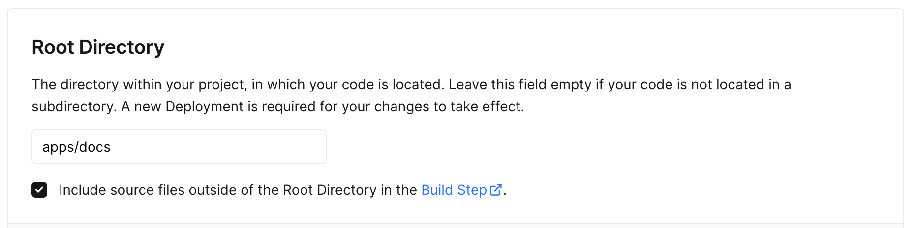
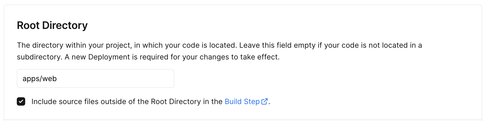

# Turborepo monorepo

Welcome to this monorepo POC, the technology used is [Turborepo](https://turbo.build/repo).
This repository was created initially with the official starter of Turborepo;

```sh
npx create-turbo@latest
```

It however includes many changes to assess if a monorepo is the right tool for us.

For a description of the changes made to the original template check [How was this project set up](#how-was-this-project-set-up) in this readme.

For the still open questions and TODOs of this POC check [TODOs](./TODOs.md)
.

## What's inside?

This Turborepo includes the following packages/apps:

### Apps and Packages

- `docs`: a [Next.js](https://nextjs.org/) app
- `web`: another [Next.js](https://nextjs.org/) app
- `ui`: a stub React component library shared by both `web` and `docs` applications. Published to npm as `marnaiz-turborepo-ui`
- `eslint-config-custom`: `eslint` configurations (includes `eslint-config-next` and `eslint-config-prettier`)
- `tsconfig`: `tsconfig.json`s used throughout the monorepo. Published to npm as `@marnaiz/turborepo-tsconfig`

Each package/app is 100% [TypeScript](https://www.typescriptlang.org/).

### Utilities

This Turborepo has some additional tools already setup for you:

- [TypeScript](https://www.typescriptlang.org/) for static type checking
- [ESLint](https://eslint.org/) for code linting
- [Prettier](https://prettier.io) for code formatting.

### Build

To build all apps and packages, run the following command:

```
cd my-turborepo
pnpm build
```

### Develop

To develop all apps and packages, run the following command:

```
cd my-turborepo
pnpm dev
```

## How was this project set up

The following steps are mere informative to understand how to set up a turborepo from scratch.
You don't need to do this, it has already been done.

### Scalfolding

Project uses [Turborepo starter](https://github.com/vercel/turbo/tree/main/examples/basic) basic template.

1. [install pnpm](https://pnpm.io/installation)

   This POC uses `pnpm` as it can handle workspaces better than `npm`/`yarn`.

1. `pnpm dlx create-turbo@latest`

### Package name changes (optional)

Internal package names where prefixed with either `marnaiz-` or `@marnaiz/` so to be able to release them publically to `npm` and not have collisions with other package names.

1. ui
   1. `packages/ui/package.json`'s `name` was changed to `marnaiz-turborepo-ui`.
   1. To propagate the changes run `pnpm install`
   1. Change broken references:
   1. Replace `ui` with `marnaiz-turborepo-ui`:
      1. `apps/docs/app/page.tsx` import now should be `from "marnaiz-turborepo-ui"`
      1. `apps/docs/next.config.js`, replace ` ["ui"]` with `["marnaiz-turborepo-ui"]`
      1. `apps/web/app/page.tsx` import now should be `from "marnaiz-turborepo-ui"`
      1. `apps/docs/next.config.js`, replace ` ["ui"]` with `["marnaiz-turborepo-ui"]`
1. tsconfig
   1. `packages/tsconfig/package.json`'s name was changed from `tsconfig` to `@marnaiz/turborepo-tsconfig`
   1. Change references:
      1. in `/package.json` (root), `apps/docs/package.json`, `apps/web/package.json`, `packages/ui/package.json`
      1. `/tsconfig.json`, `apps/docs/tsconfig.json`, `apps/web/tsconfig.json`, `packages/ui/tsconfig.json` extends property

### Adds @changesets

Turborepo is a task runner, it won't create package versions itself, for that we use [changesets](https://github.com/changesets/changesets).

1. Install `@changesets/cli`.

   ```
   pnpm install @changesets/cli -D
   ```

1. It should have automatically added the files

   1. `changeset/README.md`
   1. `changeset/config.json`, with:

      ```json
      {
        "$schema": "https://unpkg.com/@changesets/config@2.3.0/schema.json",
        "changelog": "@changesets/cli/changelog",
        "commit": false,
        "fixed": [],
        "linked": [],
        "access": "restricted",
        "baseBranch": "main",
        "updateInternalDependencies": "patch",
        "ignore": []
      }
      ```

   1. change access in `changeset/config.json`.
      This sets how packages are published. If access: `restricted`, packages will be published as private, requiring log in to an npm account with access to install. If access: `public`, the packages will be made available on the public registry.

      https://github.com/changesets/changesets/blob/main/docs/config-file-options.md#access-restricted--public

1. Add to `package.json`'s scripts

   ```json
   "changeset": "changeset",
   "changeset:enter": "changeset pre enter next",
   "changeset:pre": "pnpm changeset:enter && pnpm changeset:version",
   "changeset:exit": "changeset pre exit",
   "changeset:publish": "changeset publish",
   "changeset:version": "changeset version && pnpm i --lockfile-only",
   "release": " turbo run build --filter=docs^... && changeset publish",
   "release:pre": "pnpm changeset:pre && pnpm release",
   ```

1. Create a GitHub PAT, e.g `GH_MY_PAT`.

   https://docs.github.com/en/authentication/keeping-your-account-and-data-secure/managing-your-personal-access-tokens

   ‼️ TODO explain how ands why

1. ‼️ TODO check whether the release file is automatically added
1. Add/Replace `.github/workflows/release.yml` file with the following content.

   Note, it references the previously create PAT, variable name should match.

   There are inline comments, pay attention to them.

   ```yml
   name: Release

   on:
     push:
       branches:
         - main

   concurrency: ${{ github.workflow }}-${{ github.ref }}

   jobs:
     release:
       name: Release
       runs-on: ubuntu-latest
       steps:
         - name: Checkout Repo
           uses: actions/checkout@v2
           # based on
           # https://github.com/changesets/action/issues/295#issuecomment-1549427775
           # https://github.com/ad-m/github-push-action/issues/44#issuecomment-581706892
           with:
             persist-credentials: false # otherwise, the token used is the GITHUB_TOKEN, instead of your personal token
             fetch-depth: 0 # otherwise, you will fail to push refs to dest repo

         - name: Install pnpm
           uses: pnpm/action-setup@v2
           with:
             version: 8

         - name: Setup Node.js 16.x
           uses: actions/setup-node@v3
           with:
             node-version: 16.x
             cache: 'pnpm'

         - name: Install Dependencies
           run: pnpm install

         - name: Create Release Pull Request or Publish to npm
           id: changesets
           uses: changesets/action@v1
           with:
             # To prevent ERR_PNPM_OUTDATED_LOCKFILE error.
             # PR get's merge with changes in package.json but it doesn't update the lock file
             # https://github.com/changesets/action/issues/203#issuecomment-1460115073
             version: pnpm run version-ci
             # This expects you to have a script called release which does a build for your packages and calls changeset publish
             publish: pnpm run release
           env:
             GITHUB_TOKEN: ${{ secrets.GH_MY_PAT }}
             NPM_TOKEN: ${{ secrets.NPM_TOKEN }}

         # DISABLED FOR NOW
         # - name: Send a Slack notification if a publish happens
         #   if: steps.changesets.outputs.published == 'true'
         #   # You can do something when a publish happens.
         #   run: my-slack-bot send-notification --message "A new version of ${GITHUB_REPOSITORY} was published!"
   ```

## Changes, versioning and releases

Our research shows that the monorepo philosophy is to work _always_ with the latest changes.
That's achived by pointing dependencies to `workspace:*`, e.g.:

```
"eslint-config-custom": "workspace:*",3
```

This would mean a big change in the way we work.

Until now you were able to create a release with breaking changes and it was up to consumers to fix those breaking changes when adoption the new version.

With a monorepo where everything is always working on _latest_ the responsibility of fixing those breaking changes relies on the person introducing the breaking changes.

To avoid such a radical change we can and will be using versioning, releasing packages to npm. We will do that with a 3rd party tool; [changeset](https://github.com/changesets/changesets).

For example, to release a new version of the ui package, including changes to the `<Button>` component, we need to run a bunch of commands.

Note, pay attention to the order as there are alternatives.

### 1. Create changeset file

When we have all the changes we need and want to prepate a release we have to create a changeset file. It get's generated by running

```
pnpm changeset
```


It will ask you which packages to update, usually those with changes.

Choose between major, minor and patch


Write a message for the release notes.

It will generate a _3 word_ file inside `./.changeset/` directory. File that you should commit.


### 2a. Updating package versions (locally)

If you want your branch to include the changes updating the package.json files, run

```
changeset:version
```

#### Prereleases

Note, if you want to create a prerelease, e.g. `1.2.3-next.0`, then the command should be

```
changeset:version:pre
```

Once you are ready to release a stable release, `1.2.3`, you should

```
changeset:version:pre:exit
```

### 3a. Releasing versions, locally

To publish the packages to the registry from your machine, run

```
pnpm changeset:publish
```

### 2b. Updating package versions (by GitHub action)

Alternatively to `2a` you can create a PR with just the changeset file. Once this PR gets merged the GitHub bot will create a new PR with upgrading the `package.json`'s files.

### 3b. Releasing versions, by Github action

After the PR created by GitHub bot mentioned in 2b get's merged, the packages will be released.

## Remote Caching

Turborepo can use a technique known as [Remote Caching](https://turbo.build/repo/docs/core-concepts/remote-caching) to share cache artifacts across machines, enabling you to share build caches with your team and CI/CD pipelines.

By default, Turborepo will cache locally. To enable Remote Caching you will need an account with Vercel. If you don't have an account you can [create one](https://vercel.com/signup), then enter the following commands:

```
cd my-turborepo
npx turbo login
```

This will authenticate the Turborepo CLI with your [Vercel account](https://vercel.com/docs/concepts/personal-accounts/overview).

Next, you can link your Turborepo to your Remote Cache by running the following command from the root of your Turborepo:

```
npx turbo link
```

It can also be set up to use a [custom server for remore caching](https://turbo.build/repo/docs/core-concepts/remote-caching#custom-remote-caches).

## Deploying

As a mere showcase I have deployed the apps to Vercel.

- Docs: https://turborepo-basic-docs-pearl.vercel.app/
- Web: https://turborepo-basic-web-ivory.vercel.app/

To do so you have to create a project per `app` you want to deploy, and make sure to change the config and point to each app directory:




## Bundling

While working inside the monorepo `packages/` don't need to be bundled but if we want to consume them from a microservice (installing it from `npm`) we need to do so.

### Background

Until recencly it was common to generate commomJS (CJS) files, however we should aim to produce ES modules (ESM) so bundlers like webpack can do tree shaking and keep ES6 code if needed.

For `marnaiz-turborepo-ui` I needed to configure the package. It was a chanllenge to make it compliance with ESM and CJS. After lots of try and error it works now.

Key points.

- `package.json` should not have a `type` property,
- `main` should point to the `cjs` version
- `module` to `mjs` (aka ESM) version
- `types` to `cjs`
- `exports` property to with both inner `require` (CJS) and `import` (ESM) props.

The resources I used were:

- https://arethetypeswrong.github.io/
- https://github.com/arethetypeswrong/arethetypeswrong.github.io/blob/main/docs/problems/FalseCJS.md
- https://tsup.egoist.dev/#bundle-formats
- https://blog.isquaredsoftware.com/2023/08/esm-modernization-lessons/#round-2-results

## Useful Links

Learn more about the power of Turborepo:

- [Tasks](https://turbo.build/repo/docs/core-concepts/monorepos/running-tasks)
- [Caching](https://turbo.build/repo/docs/core-concepts/caching)
- [Remote Caching](https://turbo.build/repo/docs/core-concepts/remote-caching)
- [Filtering](https://turbo.build/repo/docs/core-concepts/monorepos/filtering)
- [Configuration Options](https://turbo.build/repo/docs/reference/configuration)
- [CLI Usage](https://turbo.build/repo/docs/reference/command-line-reference)

## Concerns

### IDE code vs version used

Working in a monorepo has the great advantage that you can jump to any file easily. This might become a doble side sword when using versioning.

Let's assume you are working on an app of the monorepo and this app uses a package from the monorepo.
You want to know how does the package work and access it.

This might be misleading because the code you see is the latest but the app could be using (pointing in `package.json`) to an older version.

In a non monorepo environment, the reference of an import would take you to the types declaration, no to the source code.
