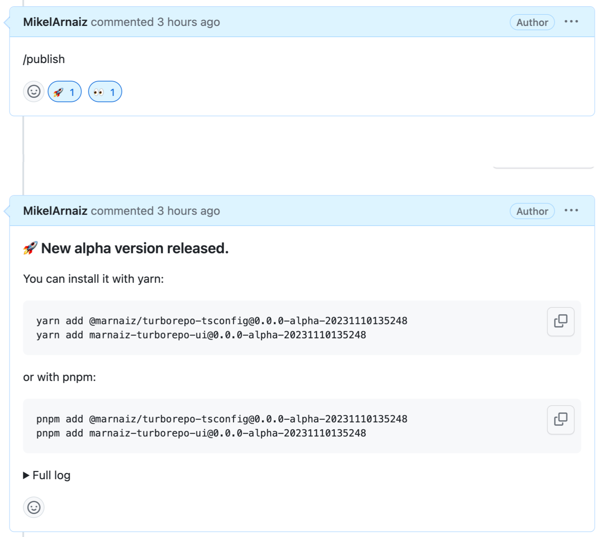

# Turborepo monorepo

Welcome to this monorepo Proof of Concept (POC), powered by [Turborepo](https://turbo.build/repo).

This repository was initially set up using the official Turborepo starter:

```sh
npx create-turbo@latest
```

However, numerous modifications have been made to evaluate whether a monorepo is the right fit for our needs. To understand the changes made to the original template, refer to [How was this project set up](./docs/setup.md) in this readme.

For ongoing questions and TODOs related to this POC, please check [TODOs](./docs/TODOs.md).

## Motivation

This POC is exclusively focused on Turborepo. While there are alternative solutions like Nx, time constraints led us to concentrate solely on Turborepo. Here are a few reasons for choosing Turborepo:

- Alignment with our tech stack: Turborepo is developed by Vercel, the same company behind Next.js.
- Future-proof: It is expected to eventually merge into a unified tool with [Turbopack](https://turbo.build/pack), the successor to Webpack.

## Getting Started

To develop all apps and packages, use the following command:

```
pnpm dev
```

To build all apps and packages, run:

```
pnpm build
```

### Package managers

This POC uses `pnpm` as a package manager.
Refer to [pnpm.io/installation](https://pnpm.io/installation) for installation instructions.

## What's inside?

This Turborepo includes the following packages/apps:

### Apps and Packages

- `docs`: a [Next.js](https://nextjs.org/) app
- `web`: another [Next.js](https://nextjs.org/) app
- `ui`: a stub React component library shared by both `web` and `docs` applications. Published to npm as `marnaiz-turborepo-ui`
- `eslint-config-custom`: `eslint` configurations (includes `eslint-config-next` and `eslint-config-prettier`)
- `tsconfig`: `tsconfig.json`s used throughout the monorepo. Published to npm as `@marnaiz/turborepo-tsconfig

## Changes, versioning and releases

Our research shows that the monorepo philosophy is to work _always_ with the latest changes.
That's achived by pointing dependencies to `workspace:*`, e.g.:

```
"eslint-config-custom": "workspace:*",
```

This would mean a big change in the way we work.

Until now you were able to create a release with breaking changes and it was up to consumers to fix those breaking changes when adoption the new version.

With a monorepo where everything is always working on _latest_ the responsibility of fixing those breaking changes relies on the person introducing the breaking changes.

To avoid such a radical change we can and will be using versioning, releasing packages to the registry. We will do that with a 3rd party tool; [changeset](https://github.com/changesets/changesets).

For example, to release a new version of the ui package, including changes to the `<Button>` component, we need to run a bunch of commands.

Note, pay attention to the order as there are alternatives.

1.  Locally

    1.  Create changeset file

        1. When we have all the changes we need and want to prepate a release we have to create a changeset file. It get's generated by running

           ```
           pnpm changeset
           ```

           

           It will ask you which packages to update, usually those with changes.

        1. Choose between major, minor and patch

           

        1. Write a message for the release notes.

           It will generate a _3 word_ file inside `./.changeset/` directory. File that you should commit.

           

    2.  Updating package versions (locally)

        If you want your branch to include the changes updating the package.json files, run

        ```
        pnpm changeset:version
        ```

    3.  Releasing versions, locally

        To publish the packages to the registry from your machine, run

        ```
        pnpm changeset:publish

        ```

1.  In PR

    1. As 1.1
    1. Updating package versions (by GitHub action)

       Alternatively to `2a` you can create a PR with just the changeset file. Once this PR gets merged the GitHub bot will create a new PR with upgrading the `package.json`'s files.

    1. Releasing versions, by Github action

       After the PR created by GitHub bot mentioned in 2b get's merged, the packages will be released.

### Alpha and prerelease versions

#### Prereleases

To create a prerelease, e.g. `1.2.3-next.0`, then the command should be

```

pnpm changeset:version:pre

```

Once you are ready to release a stable release, `1.2.3`, you should

```

pnpm changeset:version:pre:exit

```

### Alpha releases

In PRs you can add a `/publish` comment, that will trigger an alpha release.



## Remote Caching

Turborepo can use a technique known as [Remote Caching](https://turbo.build/repo/docs/core-concepts/remote-caching) to share cache artifacts across machines, enabling you to share build caches with your team and CI/CD pipelines.

By default, Turborepo will cache locally. To enable Remote Caching you will need an account with Vercel.

```

cd my-turborepo
npx turbo login

```

This will authenticate the Turborepo CLI with your [Vercel account](https://vercel.com/docs/concepts/personal-accounts/overview).

Next, you can link your Turborepo to your Remote Cache by running the following command from the root of your Turborepo:

```

npx turbo link

```

It can also be set up to use a [custom server for remore caching](https://turbo.build/repo/docs/core-concepts/remote-caching#custom-remote-caches).

## Deploying

As a mere showcase I have deployed the apps to Vercel.

- Docs: https://turborepo-basic-docs-pearl.vercel.app/
- Web: https://turborepo-basic-web-ivory.vercel.app/

To do so you have to create a project per `app` you want to deploy, and make sure to change the config and point to each app directory:


## Bundling

While working inside the monorepo `packages/` don't need to be bundled but if we want to consume them from a microservice (installing it from `npm`) we need to do so.

### Background

Until recencly it was common to generate commomJS (CJS) files, however we should aim to produce ES modules (ESM) so bundlers like webpack can do tree shaking and keep ES6 code if needed.

For `marnaiz-turborepo-ui` I needed to configure the package. It was a chanllenge to make it compliance with ESM and CJS. After lots of try and error it works now.

Key points.

- `package.json` should not have a `type` property,
- `main` should point to the `cjs` version
- `module` to `mjs` (aka ESM) version
- `types` to `cjs`
- `exports` property to with both inner `require` (CJS) and `import` (ESM) props.

The resources I used were:

- https://arethetypeswrong.github.io/
- https://github.com/arethetypeswrong/arethetypeswrong.github.io/blob/main/docs/problems/FalseCJS.md
- https://tsup.egoist.dev/#bundle-formats
- https://blog.isquaredsoftware.com/2023/08/esm-modernization-lessons/#round-2-results

## Useful Links

Learn more about the power of Turborepo:

- [Tasks](https://turbo.build/repo/docs/core-concepts/monorepos/running-tasks)
- [Caching](https://turbo.build/repo/docs/core-concepts/caching)
- [Remote Caching](https://turbo.build/repo/docs/core-concepts/remote-caching)
- [Filtering](https://turbo.build/repo/docs/core-concepts/monorepos/filtering)
- [Configuration Options](https://turbo.build/repo/docs/reference/configuration)
- [CLI Usage](https://turbo.build/repo/docs/reference/command-line-reference)
